# 1. Principe :

Le Spectral Clustering with Multiple Kernels (SCMK) [@kang_unified_nodate] est une méthode de clustering utilisant à la fois le spectral clustering, et la création d'une matrice d'affinité. Cette combinaison a pour objectif d'améliorer les performances de spectral clustering classique.  
Lorsque l'on utilise le spectral clustering, la première étape est de construire une représentation des données qui cherche à correspondre aux affinités réelles, puis on applique la méthode du spectral clustering pour regrouper les individus qui sont proches au travers de cette représentation. Cet algorithme est donc en deux étapes.  
Pour le SCMK, ces étapes sont faites simultanément. L'apprentissage de la matrice d'affinité et le regroupement des individus s'alternent, afin de profiter pleinement de l'information disponible, et de potentiellement garder l'information qui serait perdue avec un algorithme à deux étapes.  


# 2. Fonction d'objectif

La fonction d'objectif que nous avons avec le SCMK est :
$$
\min_{Z,F,P,Q,w} \underbrace{\text{Tr}(K_w - 2K_wZ +Z^TK_wZ) + \alpha||Z||_1}_{\text{Self-expressiveness}} + \underbrace{\beta\ \text{Tr}(P^TLP)}_{\text{SC - seuillage doux}} + \underbrace{\gamma \ || F - PQ||^2_F}_{\text{SC - seuillage dur}},
$$
s.c. $Z \geq 0$ ($\forall (i,j) \ Z_{ij} \geq 0$),  $\text{diag}(Z)=0$, $P^TP = I$, $Q^TQ=I$, $F \in \text{Idx}$, $K_w = \sum_{i=1}^r w_iK^i$, $\sum_{i=1}^r \sqrt{w_i}=1$, $w_i\geq 0$.  
Tr désigne la fonction Trace, et $\alpha$, $\beta$, $\gamma$ sont les paramètres de pénalisation.

Notre fonction d'objectif est répartie en 3 termes + une condition de noyau consensus :

- Self-expressiveness : $\min_Z{\text{Tr}(K - 2KZ +Z^TKZ) + \alpha||Z||_1}$ s.c. $Z \geq 0$,  $\text{diag}(Z)=0$;

- Spectral Clustering - seuillage doux : $\min_{P} \gamma\ \text{Tr}(P^TLP) ,\ \text{s.c.} \ P^TP = I$;

- Spectral Clustering - seuillage dur : $\min_{F,Q}\gamma || F - PQ||^2_F, \ \text{s.c.} \ Q^TQ = I \text{ et } F \in \text{Idx}$;

- Noyau consensus : $K_w = \sum_{i=1}^r w_iK^i$, $\sum_{i=1}^r \sqrt{w_i}=1$, $w_i\geq 0$.

## 2.1. Self-expressiveness

L'idée derrière le self_expressiveness est qu'une donnée peut être reconstruite comme combinaison linéaire des autres points, et on ajoute un terme de pénalité pour imposer une parcimonie.  
A l'origine, le problème est formulé de la façon suivante :
$$
\min_Z ||X-XZ||^2_F + \alpha ||Z||_1,\ \text{s.c.} \  Z \geq 0,\text{diag}(Z)=0.
$$

La matrice d'affinité $Z$ reflète les relations entre nos individus pour la création des clusters "optimaux". Elle se construit à partir des informations de la représentation des liens entre les données, ainsi que des groupes qui ont été construits. En effet, la matrice d'affinité $Z$ permet de représenter le lien entre les données en mettant un poids sur la proximité entre les individus. Plus un individu est proche d'un autre, plus le coefficient associé sera élevé, et inversement.  
Concernant le terme de pénalité, il permet d'avoir une représentation plus claire entre les données, limitant le nombre de coefficients non nuls, par conséquent, le nombre de liens non pertinent.

Le souci de cette formulation est qu'on suppose que tous les points se trouvent dans une union de sous-espaces indépendants/disjoints, et que les données sont non bruitées. Dans le cas où la structure des données ne correspond pas à ces cadres, la représentation sera parasitée, et donc moins précise.  
Pour cela, on peut généraliser la formule précédente par la suivante :
$$
\min_Z ||\phi(X)-\phi(X)Z||^2_F + \alpha ||Z||_1 ,\ \text{s.c.} \  Z \geq 0,\text{diag}(Z)=0.
$$
Puis, avec un peu de travail on arrive à :
$$
\min_Z ||\phi(X)-\phi(X)Z||^2_F + \alpha ||Z||_1 \Leftrightarrow \ ... \ \Leftrightarrow \ \min_Z \text{Tr}(K - 2KZ +Z^TKZ) + \alpha||Z||_1,
$$
s.c. $Z \geq 0$,  $\text{diag}(Z)=0$, et où la matrice $K = \phi(X)^T .\ \phi(X)$ est un noyau que l'on a défini en amont.

Finalement, la matrice $Z$ doit être l'argument qui correspond à :
$$
\min_Z{\text{Tr}(K - 2KZ +Z^TKZ) + \alpha||Z||_1}\ , s.c. \ Z \geq 0, \ \text{diag}(Z)=0.
$$

Cette écriture permet au modèle de trouver des relations linéaires entre les données dans le nouvel espace obtenu grâce au kernel, et par conséquent, des relations non linéaires dans la représentation originale.

## 2.2. Spectral Clustering - seuillage doux

Tout d'abord, nous supposons avoir $k$ clusters. L'objectif du spectral clustering est de trouver $F$, la matrice de clustering dur, telle que :
$$
\min_{F \in \text{Idx}} \text{Tr}(F^TLF).
$$
$F \in \{ 0,1 \}^{n \times k}$, avec $F_{i,j} = 1$ si l'individu $i$ est dans le cluster $j$, et $0$ sinon ; $L$ est le laplacien.

Ce problème est très complexe à résoudre à cause de la contrainte de discrétisation des valeurs de F. Afin d'avoir une solution, On peut relaxer celle-ci, et par ailleurs avoir la formulation plus habituelle du spectral clustering :
$$
\min_{P} \text{Tr}(P^TLP) ,\ \text{s.c.} \ P^TP = I,
$$
où $I$ représente la matrice identité, et $P \in \mathbb{R}^{n \times k}$, la matrice de clusterig doux.  
C'est par les points précédents que nous avons le terme suivant dans la fonction d'objectif du SCMK :

$$
\min_P{\beta \ \text{Tr}(P^TLP)}, \ \text{s.c.} \ P^TP = I.
$$

## 2.3. Spectral Clustering - seuillage dur

Dans le spectral clustering classique, le passage de la matrice $P$ à la matrice $F$, est obtenu par l'une méthode de clustering classique, comme les K-means, sur $P$. Ici, nous utiliserons une autre méthode : le lien entre les matrices $P$ et $F$, par l'intermédiaire d'une matrice de rotation $Q$.  
En effet, Si $P$ est une solution du spectral clustering, par invariance des solutions, $PQ$ l'est aussi. Donc, l'idée est d'avoir $P$ et $Q$ de telle manière que $PQ$ soit le plus proche possible de la "vraie" matrice de clustering, la matrice de clustering dur $F$.
$$
\min_{F,Q}\gamma || F - PQ||^2_F, \ \text{s.c.} \ Q^TQ = I \text{ et } F \in \text{Idx}.
$$

## 2.4 Noyau consensus

La matrice d'affinité dépend grandement du noyau utilisé. Celui-ci est un choix a priori que l'on fait, on sélectionne l'espace dans lequel les données sont projetés. Afin de rendre ce choix moins important, au sens de l'impact sur les performances de la méthode, on peut par exemple utiliser une combinaison convexe de noyaux.
L'objectif est d'arriver à extraire un maximum d'informations permettant de mieux regrouper les données à partir des différents noyaux.  
Il s'agit de la méthode employé pour combiner les noyaux dans cet algorithme. L'information de chaque noyau est pondéré en fonction de sa pertinence, de sa contribution, pour le clustering. C'est pour cela que dans nos autres termes nous trouvons $K_w$ le noyau consensus, et qu'il y a les conditions suivantes dans les contraintes :
$$
K_w = \sum_{i=1}^r w_iK^i, \ \sum_{i=1}^r \sqrt{w_i}=1 \text{ et } w_i\geq 0.
$$
la condition de pondération est $\sum_{i=1}^r \sqrt{w_i}=1$ puisque, si l'on définit $\phi_w(x) = \left[\sqrt{w_1}\phi_1(x),...,\sqrt{w_r}\phi_r(x)\right]$ :
$$
K_w(x,y) = <\phi_w(x),\phi_w(y)> = \sum_{i=1}^r w_iK^i(x,y) .
$$

# 3. Algorithme et optimisation des paramètres

L'optimisation des paramètres se fera grâce à la méthode d'optimisation "Alternating Direction Method of Multipliers" (ADMM). Cette méthode utilise le lagrangien augmenté, et à la particularité de permettre, à chaque étape d'optimisation, de fixer tous les paramètres puis de les optimiser un à un.
Dans le but d'optimiser cette fonction, le problème de minimisation peut se réécrire sous la forme suivante :
\begin{equation*}
\begin{gathered}
\min_{Z,F,P,Q,w} \text{Tr}(K_w - 2K_wZ +Z^TK_wZ) + \alpha||S||_1 + \beta\ \text{Tr}(P^TLP) + \gamma \ || F - PQ||^2_F\\ 
s.c.\  Z \geq 0,  \text{diag}(Z)=0, P^TP = I, Q^TQ=I, F \in \text{Idx}, K_w = \sum_{i=1}^r w_iK^i, \sum_{i=1}^r \sqrt{w_i}=1, S=Z.
\end{gathered}
\end{equation*}

La principale différence entre cette écriture et la précédente est le changement de variable dans la norme 1, la matrice auxiliaire S à la place de la matrice d'affinité Z. Afin de conserver le lien avec l'écriture précédente, il a fallu imposer une contrainte d'égalité, permettant à la fonction d'objectif d'être séparable, en ces termes. 


## 3.1. La matrice auxiliaire de Z : S 

La première étape consiste par écrire le lagrangien augmenté, en $S$ et en $Z$ : 
$$
{L}(S,Z,Y) = \text{Tr}(K_w - 2K_wZ +Z^TK_wZ) + \alpha||S||_1 + \beta\ \text{Tr}(P^TLP) + <Y,\ S-Z>_F +\frac{\mu}{2}||S-Z||^2_F\ .
$$
Bien que cette écriture soit formelle, il est nécessaire de réécrire les deux derniers termes afin de pouvoir optimiser la fonction d'objectif en $S$ et en $Z$.
\begin{equation*}
\begin{split}
<Y,\ S-Z>_F +\frac{\mu}{2}||S-Z||^2_F &= \frac{\mu}{2}||S-Z||^2_F + <Y,\ S-Z>_F  + \frac{1}{2\mu} ||Y||^2_F - \frac{1}{2\mu} ||Y||^2_F \\
&=\frac{\mu}{2} \left(  ||S-Z||^2_F + \frac{2}{\mu} <Y,\ S-Z>_F + \frac{1}{\mu^2} ||Y||^2_F\right) - \frac{1}{2\mu} ||Y||^2_F \\
&=\frac{\mu}{2} \left(  ||S-Z||^2_F + 2 <\frac{Y}{\mu} ,\ S-Z>_F + ||\frac{Y}{\mu}||^2_F\right) - \frac{1}{2\mu} ||Y||^2_F \\
&=\frac{\mu}{2} ||S-Z +\frac{Y}{\mu}||^2_F - \frac{1}{2\mu} ||Y||_F \ . \\
\end{split}
\end{equation*}

L'objectif étant de minimiser en $S$ et en $Z$, le terme $- \frac{1}{2\mu} ||Y||_F$ est négligeable. Le lagrangien peut donc s'écrire de la manière suivante :
$$
{L}(S,Z,Y) = \text{Tr}(K_w - 2K_wZ +Z^TK_wZ) + \alpha||S||_1 + \beta\ \text{Tr}(P^TLP)  +\frac{\mu}{2}||S-Z+\frac{Y}{\mu}||^2_F \ .
$$
La matrice $S$ optimale correspond à :
$$
\underset{S}{\mathrm{argmin}} \ \alpha||S||_1 + \frac{\mu}{2}||S-Z+\frac{Y}{\mu}||^2_F \ .
$$
Nous cherchons donc une matrice $S$ qui minimise une somme de termes positifs, le problème peut donc se réécrire de la manière suivante : 
$$
\underset{S_{ij}}{\mathrm{argmin}} \ \alpha||S_{ij}||_1 + \frac{\mu}{2}||S_{ij}-Z_{ij}+\frac{Y_{ij}}{\mu}||^2_F\ , \ \forall (i,j) \in \{1,...,n\}^2 .
$$
Le problème revient maintenant à travailler avec des variables dans $\mathbb{R}$, l'expression précédente peut donc être développé simplement.
\begin{equation*}
\begin{split}
\underset{S_{ij}}{\mathrm{argmin}} \ \alpha||S_{ij}||_1 + \frac{\mu}{2}||S_{ij}-Z_{ij}+\frac{Y_{ij}}{\mu}||^2_F
&= \underset{S_{ij}}{\mathrm{argmin}} \ \alpha|S_{ij}| + \frac{\mu}{2}(S_{ij}-Z_{ij}+\frac{Y_{ij}}{\mu})^2\\
&=\underset{S_{ij}}{\mathrm{argmin}} \ \alpha|S_{ij}| + \frac{\mu}{2}(S_{ij}-H_{ij})^2,
\end{split}
\end{equation*}
avec $H_{ij} = Z_{ij}-\frac{Y_{ij}}{\mu}$.  
On peut donc dériver cette expression par rapport à $S_{ij}$, et annuler celle-ci. On distingue 3 cas :

- $S_{ij} > 0$ : la dérivée de $|S_{ij}| = 1$, donc on a : $\alpha + \mu(S_{ij}-H_{ij}) = 0 \Leftrightarrow S_{ij} = H_{ij} - \frac{\alpha}{\mu}$ pour $H_{ij} > \frac{\alpha}{\mu}$.

- $S_{ij} < 0$ : la dérivée de $|S_{ij}| = -1$, donc on a : $-\alpha + \mu(S_{ij}-H_{ij}) = 0 \Leftrightarrow S_{ij} = H_{ij} + \frac{\alpha}{\mu}$ pour $H_{ij} < - \frac{\alpha}{\mu}$.

- $S_{ij} = 0$ : Les sous-gradients de la norme 1 varient entre ]-1;1[ mais la valeur de $S_{ij}$ reste à 0.

Donc, la matrice S est mise à jour par :
\begin{equation}
S_{ij} = \max(|H_{ij}|-\frac{\alpha}{\mu})\ . \ \text{sign}(H_{ij}), \ \forall(i,j) \in \{1,...,n\}^2.
\end{equation}

### 3.2. La matrice d'affinité : Z

Tout d'abord, nous posons les notations ci-dessous :

- $E = S + \frac{Y}{\mu}$ ;

- $D$ tel que $D_{i,j} = ||P_{i,:} - P_{j,:}||^2_2$ ;

- $F(Z) = \text{Tr}(K_w - 2K_wZ +Z^TK_wZ) + \beta \ \text{Tr}(P^TLP) + \frac{\mu}{2}||S-Z+\frac{Y}{\mu}||^2_F$ .

Par ailleurs, on remarquera que  $\text{Tr}(P^TLP) = \sum_{ij}\frac{1}{2}||P_{i,:} - P_{j,:}||^2_2 s_{ij}$ .

La mise à jour de la matrice d'affinité $Z$ doit correspondre à l'argument qui minimise $F(Z)$. Afin de trouver la matrice $Z$ optimale, il est nécessaire de travailler sur l'expression qu'elle doit minimiser :
\begin{equation*}
\begin{split}
\underset{Z}{\mathrm{argmin}} \ F(Z)&= \underset{Z}{\mathrm{argmin}}\  \text{Tr}(K_w - 2K_wZ +Z^TK_wZ) + \beta \ \text{Tr}(P^TLP) + \frac{\mu}{2}||E-Z||^2_F\\
&=\underset{Z}{\mathrm{argmin}}\ \text{Tr}( -2K_wZ +Z^TK_wZ) + \frac{\beta}{2} \ \sum_{ij}||P_{i,:} - P_{j,:}||^2_2 Z_{ij} + \frac{\mu}{2}||E-Z||^2_F\\
&=\underset{Z}{\mathrm{argmin}}\  \text{Tr}(- 2K_wZ +Z^TK_wZ) + \frac{\beta}{2} \ Tr(DZ) + \frac{\mu}{2}(-2Tr(E^TZ) + Tr(Z^TZ)).
\end{split}
\end{equation*}
Soit $\tilde{F}(Z) = \text{Tr}(- 2K_wZ +Z^TK_wZ) + \frac{\beta}{2} \ Tr(DZ) + \frac{\mu}{2}(-2Tr(E^TZ) + Tr(Z^TZ))$, la matrice $Z$ qui annule la dérivée cette fonction sera solution de notre minimisation. Pour la trouver, il nous faut tout d'abord calculer la dérivée de $\tilde{F}$ :
\begin{equation*}
\begin{split}
\frac{\partial \tilde{F}(Z)}{\partial Z} &= -2K_w^T + K_wZ + K_w^TZ + \frac{\beta}{2} D^T - \mu E^T +\frac{\mu}{2}(IZ + I^TZ)\\
&= -2K_w + 2 K_wZ + \frac{\beta}{2} D - \mu E +\mu Z\\
&= -2K_w + \frac{\beta}{2} D - \mu E +(\mu I + 2 K_w)Z.
\end{split}
\end{equation*}

La matrice $Z$ optimale correspond donc à celle annulera cette dérivée, et est obtenue par résolution de l'équation suivante : 
\begin{equation*}
\begin{split}
\frac{\partial \tilde{F}(Z)}{\partial Z} = 0 &\Leftrightarrow -2K_w + \frac{\beta}{2} D - \mu E +(\mu I + 2 K_w)Z = 0\\
&\Leftrightarrow  (\mu I + 2 K_w)Z = 2K_w - \frac{\beta}{2} D + \mu E\\
&\Leftrightarrow  Z = (\mu I + 2 K_w)^{-1}(2K_w - \frac{\beta}{2} D + \mu E).
\end{split}
\end{equation*}
Finalement, le $Z$ qui minimise notre quantité de départ est donc :
\begin{equation}
Z = (\mu I + 2 K_w)^{-1}(2K_w - \frac{\beta}{2} D + \mu E).
\end{equation}

### 3.3. Le multiplicateur de Lagrange : Y

$Y$ est le multiplicateur de Lagrange associé au problème. Ce paramètre gère le lien entre les matrices $S$ et $Z$ et évolue selon celui-ci. En effet, plus $S$ et $Z$ seront éloignées, plus les valeurs dans la matrice $Y$ seront grandes, et inversement. De plus, lors de la mise à jour de $Y$ un paramètre de régularité, $\mu$ intervient, permettant d'ajuster le poids de la contrainte d'égalité.  
La mise à jour de ce paramètre se fait de la manière suivante :
\begin{equation}
Y = Y + \mu(S-Z).
\end{equation}

### 3.4. La matrice de clustering doux : P

Il s'agit de la variable la plus compliquée à optimiser de l'algorithme. La matrice de clustering doux $P$ doit correspondre à la relation ci-dessous :
$$
\underset{P}{\mathrm{argmin}}\ \text{Tr}(P^TLP) + \gamma \ || F - PQ||^2_F , \text{ s.c. }P^TP=I.
$$
Si l'on se restreignait à trouver l'argument $P$ qui correspond à $\underset{P}{\mathrm{argmin}}\ \text{Tr}(P^TLP), \text{ s.c. }P^TP=I$, il s'agirait de la démarche du spectral clustering. La matrice $P$ optimale serait obtenue par la décomposition en valeurs singulières de $L$, plus précisément par les $k$ derniers vecteurs propres, où l'on normaliserait chaque ligne.  
Dans notre cas un terme en plus est présent, $\gamma \ || F - PQ||^2_F$. Donc, pour trouver l'argument qui minimise la quantité qui nous intéresse, il faut se baser sur la méthode développée par Wen et Yin [@wen_feasible_2013].

### 3.5. La matrice de rotation : Q

La mise à jour la matrice $Q$ est la solution du problème ci-dessous :
$$
\underset{Q}{\mathrm{argmin}}\ \gamma \ || F - PQ||^2_F, \text{ s.c. } Q^TQ=I.
$$
Il s'agit d'un problème de Procruste orthogonal, avec pour matrice cible $F$ et la matrice à transformer $P$.  
Afin de le résoudre, il suffit de suivre la démarche présentée dans l'article consacré à ce problème [@schonemann_generalized_1966].  
Tout d'abord, il faut commencer par la décomposition en valeurs singulières de la matrice $M =F P^T$, nous donnant $M = U\Sigma V^T$.  
Ensuite, la matrice de rotation $Q$ est obtenue par simple produit des parties gauche et droite de cette décomposition :
\begin{equation}
Q = U V^T.
\end{equation}

### 3.6. La matrice de clustering dur : F

La matrice de clustering dur $F$ doit correspondre à : 
$$
\underset{F}{\mathrm{argmin}} \ \gamma \ || F - PQ||^2_F, \text{ s.c. }  F \in \text{Idx}.
$$
L'expression ci-dessus peut être retravailler pour être plus facilement optimisée :
\begin{equation*}
\begin{split}
\underset{F}{\mathrm{argmin}} \ \gamma \ || F - PQ||^2_F &= \underset{F}{\mathrm{argmin}} \  ||F||_F^2 - 2 <F,PQ>_F + ||PQ||^2_F\\
&= \underset{F}{\mathrm{argmin}} \  \underbrace{\text{Tr}(F^TF)}_{= \ n} - 2 \text{Tr}(F^TPQ) \\
&= \underset{F}{\mathrm{argmax}} \ \text{Tr}(F^TPQ). \\
\end{split}
\end{equation*}
Donc pour trouver l'argument $F$ qui minimise notre fonction d'objectif, la matrice de clustering dur $F$ doit correspondre à la matrice qui maximise $\text{Tr}(F^TPQ) \text{ s.c. }  F \in \text{Idx}$. Pour maximiser cette quantité, avec cette contrainte, il suffit de prendre la matrice $F$ telle que :
\begin{equation}
F_{ij}= \left\{
    \begin{array}{ll}
        1 & \mbox{si } j=\underset{k}{\mathrm{argmax}}(PQ)_{ik} \\
        0 & \mbox{sinon.}\\
    \end{array}
\right.
\end{equation}

### 3.7. Pondération des différents noyaux : w

La mise à jour de la pondérations des noyaux $w$ est obtenue par la résolution du problème ci-dessous :
$$
\underset{w}{\mathrm{argmin}} \sum_{i=1}^r w_ih_i , \text{ s.c. } \sum_{i=1}^r \sqrt{w_i}=1, w_i\geq 0,
$$
avec $h_i = \text{Tr}(K^i - 2K^iZ +Z^TK^iZ)$, où $K^i$ représente le i-ème kernel.

Afin de trouver la solution de ce problème, il faut commencer par écrire lagrangien correspondant :
$$
J(w) = w^Th + \xi (1- \sum_{i=1}^r \sqrt{w_i}) \ .
$$
En dérivant le lagrangien, puis en annulant cette dérivée, nous trouverons la mise à jour des poids optimale.
\begin{equation*}
\begin{split}
\frac{\partial J(w)}{\partial w_i} = 0 &\Leftrightarrow h_i - \frac{\xi}{2\sqrt{w_i}} = 0\\
&\Leftrightarrow  h_i = \frac{\xi}{2\sqrt{w_i}}\\
&\Leftrightarrow  \sqrt{w_i} = \frac{\xi}{2h_i}
\end{split}
\end{equation*}
La formule ci-dessus correspond à la solution pour trouver les poids optimaux, mais il reste encore le paramètre $\xi$ qui est inconnu, et donc à trouver.    
Par les conditions de Karush-Kuhn-Tucker (KKT), il est nécessaire que $\xi (1- \sum_{i=1}^r \sqrt{w_i}) = 0$. Par ailleurs, on supposera que $\xi$ est différent de 0.  
\begin{equation*}
\begin{split}
\xi (1- \sum_{i=1}^r \sqrt{w_i}) &= 0\\
\sum_{j=1}^r \sqrt{w_j} &= 1\\
\sum_{j=1}^r \frac{\xi}{2h_j} &= 1\\
\frac{1}{\xi} &= \sum_{j=1}^r \frac{1}{2h_j}\\
\xi  &= \Big(\sum_{j=1}^r \frac{1}{2h_j} \Big)^{-1}.
\end{split}
\end{equation*}

En injectant ce résultat pour $\xi$ dans l'équation définissant les $w_i$ optimaux, on obtient :
\begin{equation*}
\begin{split}
\sqrt{w_i} &= \frac{\Big(\sum_{j=1}^r \frac{1}{2h_j} \Big)^{-1}}{2h_i}\\
\sqrt{w_i} &= \Big({h_i}\sum_{j=1}^r \frac{1}{h_j}  \Big)^{-1}\\
w_i &= \Big({h_i}\sum_{j=1}^r \frac{1}{h_j}  \Big)^{-2} \ .
\end{split}
\end{equation*}

Finalement, les poids $w_i$ optimaux sont obtenus par l'égalité suivante :
\begin{equation}
w_i = \Big({h_i}\sum_{j=1}^r \frac{1}{h_j}  \Big)^{-2}, \ \forall i \in \{1,\ldots,r\}.
\end{equation}

\newpage
## Algorithme
\begin{algorithm}
\caption{Spectral Clustering Multiple Kernels}
\begin{algorithmic} 
\REQUIRE Nombre de clusters $k$, ensemble de kernels $\{K^i\}_{i=1}^{r}$, paramètres $\alpha,\beta,\gamma,\mu>0$.
\STATE Initialisation : Z,P,Q aléatoires, $w_i=1/r$, Y = 0. 
\WHILE{Le critère d'arrêt n'est pas satisfait}
\STATE Calculer $K_w$
\STATE Mise à jour de $S$ par (1).
\STATE $S_{ii}=0,\ \forall i \in \{1,\ldots,n\}$ et $S_{ij}=\max(S_{ij},0)$.
\STATE Mise à jour de $Z$ par (2).
\STATE $Z_{ii}=0,\ \forall i \in \{1,\ldots,n\}$ et $Z_{ij}=\max(Z_{ij},0)$, puis $Z = \frac{Z + Z^T}{2}$.
\STATE Mise à jour de $Y$ par (3).
\STATE Mise à jour de $P$
\STATE Mise à jour de $Q$ par (4).
\STATE Mise à jour de $F$ par (5).
\STATE Mise à jour de $w$ par (6).
\ENDWHILE
\end{algorithmic}
\end{algorithm}


# 4. Algorithmes dérivés :

## 4.1. SCMK K-Means


\begin{algorithm}
\caption{SCMK K-Means}
\begin{algorithmic} 
\REQUIRE Nombre de clusters $k$, ensemble de kernels $\{K^i\}_{i=1}^{r}$, paramètres $\alpha,\beta,\mu>0$.
\STATE Initialisation : Z,P aléatoires, $w_i=1/r$, Y = 0. 
\WHILE{Le critère d'arrêt n'est pas satisfait}
\STATE Calculer $K_w$
\STATE Mise à jour de $S$ par (1).
\STATE $S_{ii}=0,\ \forall i \in \{1,\ldots,n\}$ et $S_{ij}=\max(S_{ij},0)$.
\STATE Mise à jour de $Z$ par (2).
\STATE $Z_{ii}=0,\ \forall i \in \{1,\ldots,n\}$ et $Z_{ij}=\max(Z_{ij},0)$, puis $Z = \frac{Z + Z^T}{2}$.
\STATE Mise à jour de $Y$ par (3).
\STATE On fait la décomposition en valeurs singuliaires de L : $L = U\Sigma V^T$
\STATE On pose $\tilde{U} = U[:,n-k+1:n]$, puis on normalise les lignes de $\tilde{U}$.
\STATE Mise à jour de $P$ : P = $\tilde{U}$.
\STATE Mise à jour de $F$ : K-Means sur $P$.
\STATE Mise à jour de $w$ par (6).
\ENDWHILE
\end{algorithmic}
\end{algorithm}

Le SCMK utilise une matrice de rotation afin d'approcher le clustering dur des données. Cette partie implique de devoir régler un hyperparamètre : $\gamma$. Dans cette variante, plusieurs modifications ont été faites :

- Enlever la matrice de rotation Q.

- Choisir F à partir d'un K-means sur P.

Cette variante impliquera un changement important dans la méthode SCMK, celui de la mise à jour de $P$.  
En effet, maintenant que le terme $\gamma \ || F - PQ||^2_F$ n'est plus dans la fonction d'objectif, l'optimisation de $P$ est simplement : $\underset{P}{\mathrm{argmin}}\ \text{Tr}(P^TLP), \text{ s.c. }P^TP=I$, ce qui revient à faire la procédure du spectral clustering pour optimiser cette variable.  
Par conséquent, la démarche définissant le SCMK K-Means correspond à l'algorithme ci-dessus.

## 4.2. Self-expressiveness

Cette variante est un algorithme en deux étapes.La première consiste à construire une représentation des données à partir des noyaux afin de pouvoir regrouper les individus. La seconde est simplement un spectral clustering à partir de cette représentation.

La différence entre cet algorithme et les précédents est que cette fois-ci il n'y a pas d'alternance entre représentation des données et classification. On perd donc l'aspect une étape des méthodes SCMK et SCMK K-means.  
En revanche, nous avons un gain en terme d'hyperparamètre, puisque le paramètre $\beta$ et le terme associé sont enlevés de la fonction d'objectif.

Ces modifications impliquent aussi un changement lors des mises à jour des paramètres, et dans ce cas-ci il s'agit d'une modification de la mise à jour de la matrice d'affinité $Z$.  
Celle-ci est maintenant obtenues par la formule suivante :

\begin{equation}
Z = (\mu I + 2 K_w)^{-1}(2K_w + \mu E).
\end{equation}

\begin{algorithm}
\caption{Self-expressiveness}
\begin{algorithmic} 
\REQUIRE Nombre de clusters $k$, ensemble de kernels $\{K^i\}_{i=1}^{r}$, paramètres $\alpha,\mu>0$.
\STATE Initialisation : Z aléatoire, $w_i=1/r$, Y = 0. 
\WHILE{Le critère d'arrêt n'est pas satisfait}
\STATE Calculer $K_w$
\STATE Mise à jour de $S$ par (1).
\STATE $S_{ii}=0,\ \forall i \in \{1,\ldots,n\}$ et $S_{ij}=\max(S_{ij},0)$.
\STATE Mise à jour de $Z$ par (7).
\STATE $Z_{ii}=0,\ \forall i \in \{1,\ldots,n\}$ et $Z_{ij}=\max(Z_{ij},0)$, puis $Z = \frac{Z + Z^T}{2}$.
\STATE Mise à jour de $Y$ par (3).
\STATE Mise à jour de $w$ par (6).
\ENDWHILE
\STATE Spectral Clustering sur le laplacien de $Z$
\end{algorithmic}
\end{algorithm}

\newpage
# 5. Exemple(s)
```{r setup, include=FALSE}
knitr::opts_chunk$set(echo = FALSE)
knitr::opts_chunk$set(fig.pos = "!h", out.extra = "")
library(ggplot2)
```
Afin de pouvoir tester les capacités de notre algorithme, nous avons décidé de l'appliquer à des données générées afin de voir les performances à travers certaines mesures spécifiques, ainsi que sa stabilité.

## 5.1. 3 Gaussiennes 

Cet exemple est le plus simple, dans le sens où les groupes sont intuitifs. Il servira de référence pour voir le comportement de l'algorithme et aussi à comprendre l'impact des hyper-paramètres sur ce modèle, et celui du choix du noyau.  
Nous avons choisi de simuler des vecteurs gaussiens de $\mathbb{R}^2$ où la matrice de variance-covariance est diagonale.

Tout d'abord, dans la partie train :

- Groupe 1 : 100 réalisations où chaque coordonnée est donnée par une gausienne $N(0,1)$

- Groupe 2 : 100 réalisations où chaque coordonnée est donnée par une gausienne $N(3,1)$

- Groupe 3 : 100 réalisations où chaque coordonnée est donnée par une gausienne $N(6,1)$


Pour la partie test, il s'agit des 3 mêmes groupes, seulement les effectifs sont divisés par deux : 

- Groupe 1 : 50 réalisations où chaque coordonnée est donnée par une gausienne $N(0,1)$

- Groupe 2 : 50 réalisations où chaque coordonnée est donnée par une gausienne $N(3,1)$

- Groupe 3 : 50 réalisations où chaque coordonnée est donnée par une gausienne $N(6,1)$

On peut représenter ces points dans le plan, ce qui nous donne les graphiques suivants : 

```{r gaussian, fig.show = "hold", out.width = "49%", fig.align = "center",fig.cap="Données train et test, représentées dans le plan séparément. A gauche, nous avons les données d'entraînement et à droite les données de test."} 
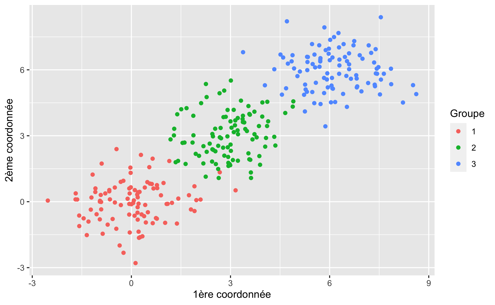

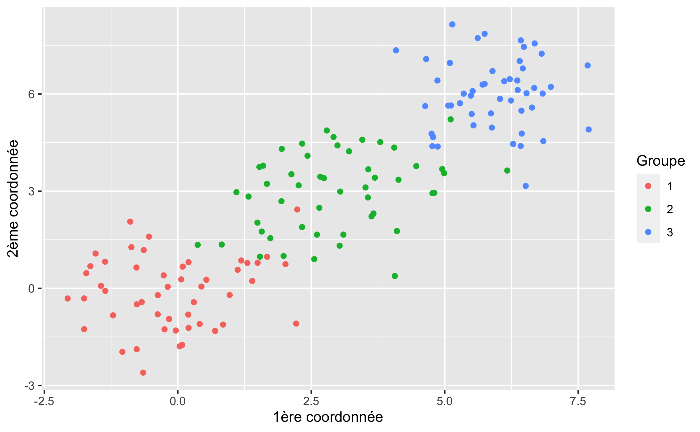
```

L'idée sous-jacente était d'avoir des groupes assez facilement reconnaissables mais avec un possible chevauchement, afin de constater l'influence que ça aura sur le clustering. Par exemple, certains éléments d'un groupe pourraient potentiellement faire parti d'un autre, ce qui peut créer quelques petites perturbation dans le clustering.


### 5.1.1. Noyau Polynomial de degré 2


Le premier noyau utilisé est de la forme : $K(x,y) = (x^Ty +1)^2$. Il s'agit d'un noyau polynomial de degré deux, et l'idée est de capturer un lien quadratique entre les données. 

```{r Kernel_poly, fig.show = "hold", out.width = "50%", fig.align = "default",fig.cap="Représentation de la matrice noyau sur les données train et test. Plus les points sont clairs, plus la valeur est grande. A gauche, il s'agit de la matrice des données d'entraînements, et à droite il s'agit de la matrice des données de test."} 
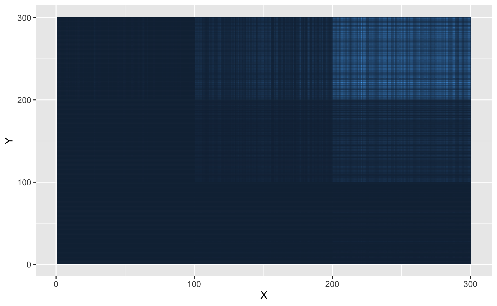

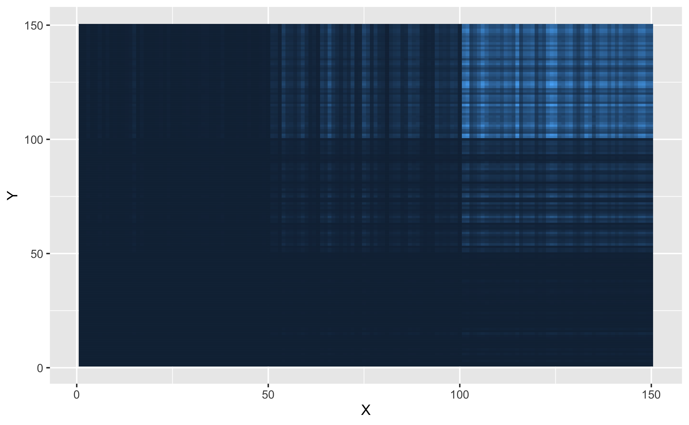
```

A partir de cette nouvelle matrice, on peut utiliser diverses méthodes pour arriver à regrouper les individus. Dans notre cas, nous utiliserons les trois algorithmes présentés précédemment.  
Afin de quantifier les performances, ainsi que d'avoir un critère pour choisir au mieux nos hyperparamètres, nous utiliserons deux mesures différentes : 

- Adjusted Rand Index (ARI) ;

- Normalized Mutual Information (NMI).

Tout d'abord, plusieurs essais ont été effectués sur la base de données d'entraînement afin de trouver les hyperparamètres optimaux, i.e. ceux qui donnent le meilleur clustering au point de vue de la mesure utilisée.  
Puisque les deux sont différentes, la quantification de celles-ci diffèrent, le jeu d'hyperparamètres peut être différent. C'est pour cette raison que les résultats seront scindés en deux parties, l'une concernant l'ARI et l'autre la NMI.

```{r res_ari_poly, fig.show = "hold", out.width = "50%", fig.align = "default",fig.cap="Boxplot des scores obtenus sur le jeu de données test après 30 applications des algorithmes. Le boxplot de gauche concerne la mesure ARI, et celui de droite la mesure NMI."} 
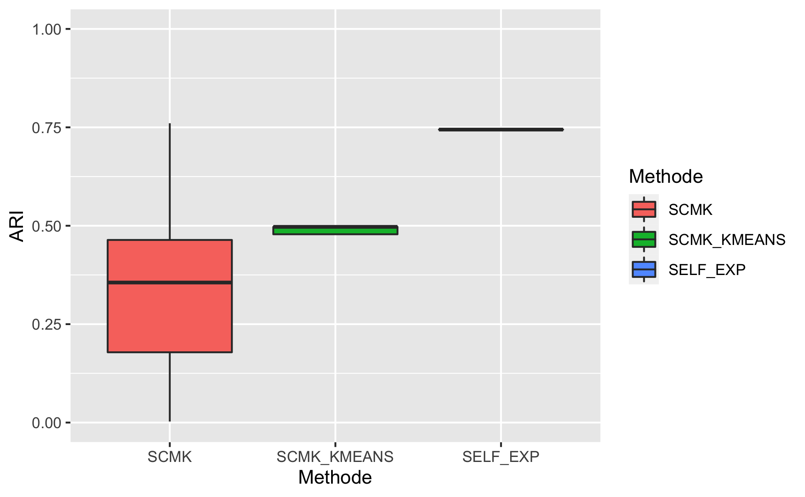
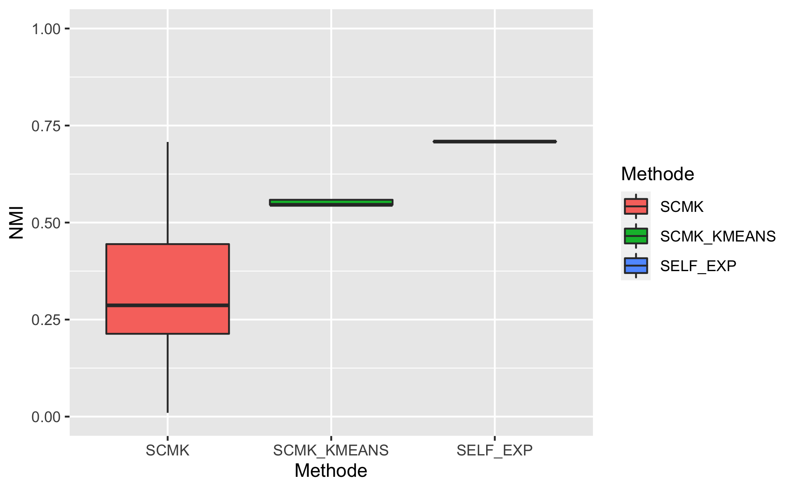
```

On constate qu'avec le meilleur ensemble d'hyperparamètres, conformément à chaque mesure et à chaque algorithme, la répartition des scores est n'est pas identique selon la méthode employée. Le Self-expressiveness dépasse les performances des autres algorithmes  et avec régularité. Sur les 30 fois où l'algorithme a été utilisé sur le jeu de données test, le score est resté identique. Les scores du self-expressiveness ainsi que du SCMK K-means ont plus tendance à être stable, par rapport à l'initialisation, contrairement au SCMK.

Les scores du SCMK sont très fluctuants, passant du meilleur score entre nos algorithmes au pire. Pour la plupart des résultats obtenus, ils sont majoritairement en dessous du pire score des autres algorithmes. Ceci met en évidence un problème de stabilité.

Pour avoir une idée de ce que représente ces scores, on peut voir des exemples de prédiction ayant les résultats moyens des boxplots ci-dessus.

```{r pred_ari_poly, fig.show = "hold", out.width = "49%", fig.align = "center",fig.cap="Graphiques des prédictions obtenues à partir de l'optimisation des hyperparamètres par rapport à la mesure ARI. Le premier graphique est celui du SCMK, le second celui du SCMK K-Means et le dernier correspond au Self-Expressiveness."} 
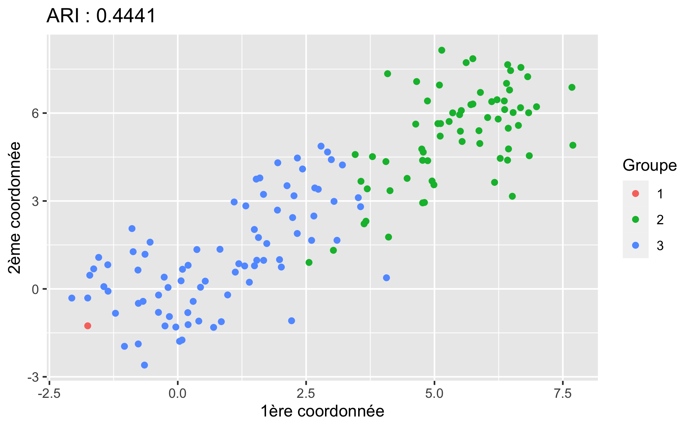
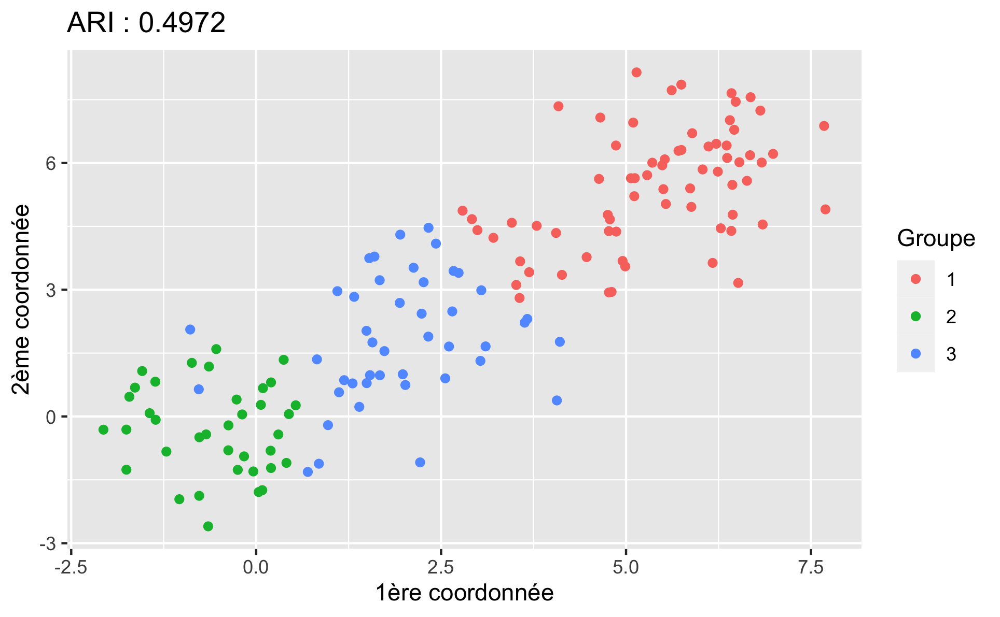
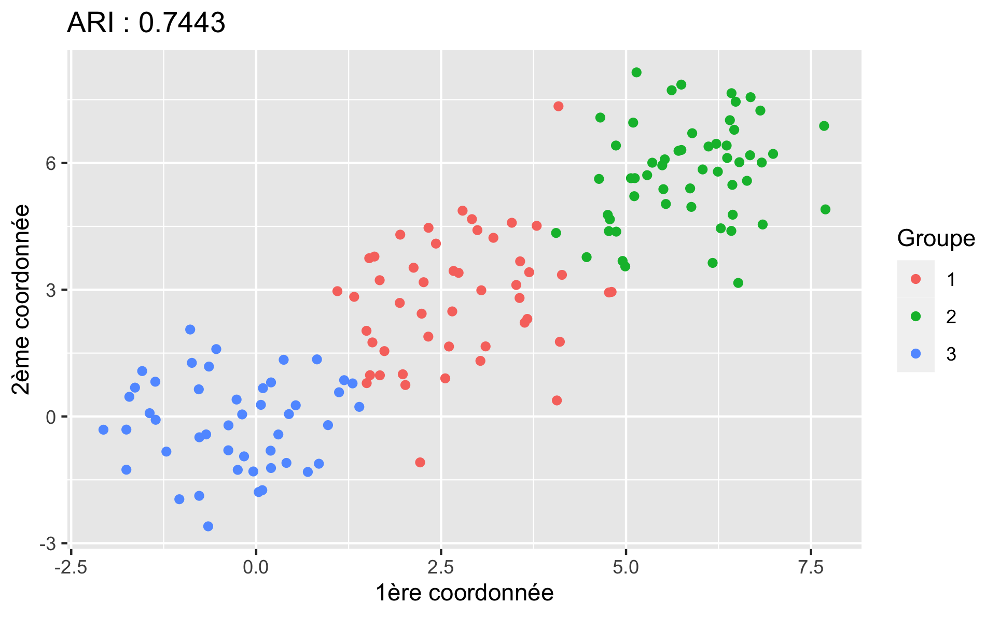
```

On constate qu'avec ces prédictions qui correspondent au résultat moyen des algorithmes, le SCMK ne trouve que deux groupes principaux, avec un seul élément dans le troisième groupe.  
Concernant le SCMK K-Means, trois groupes ont été trouvés mais ils ne correspondent pas aux groupes que nous avons. De plus, certaines affections sont étonnantes comme pour certains individus du groupe 3 qui sont au milieu d'individus du groupe 2 (avec les notations du graphique associé).  
Pour ce qui est du Self-Expressiveness, on constate que globalement les groupes obtenus correspondent à ce qu'on attendait. Il n'y a pas d'affection qui parait abbérante. Ceci est directement traduit dans le score ARI.

### 5.1.2. Noyau RBF, sigma = 1

Le noyau utilisé est un noyau gaussien, de la forme : $K_\sigma(x,y) = \exp\left(-\frac{||x-y||^2}{2\sigma}\right)$.
```{r Kernel RBF, fig.show = "hold", out.width = "50%", fig.align = "default",fig.cap="Représentation de la matrice noyau sur les données train et test."} 
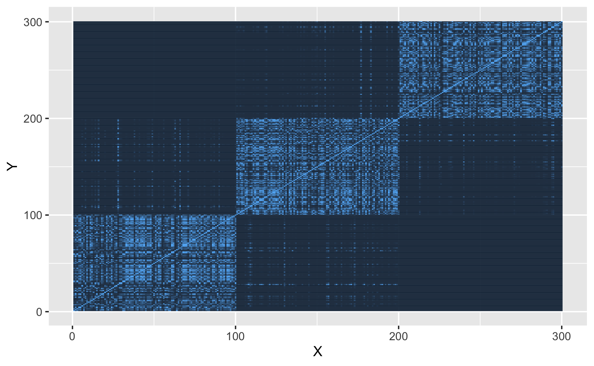

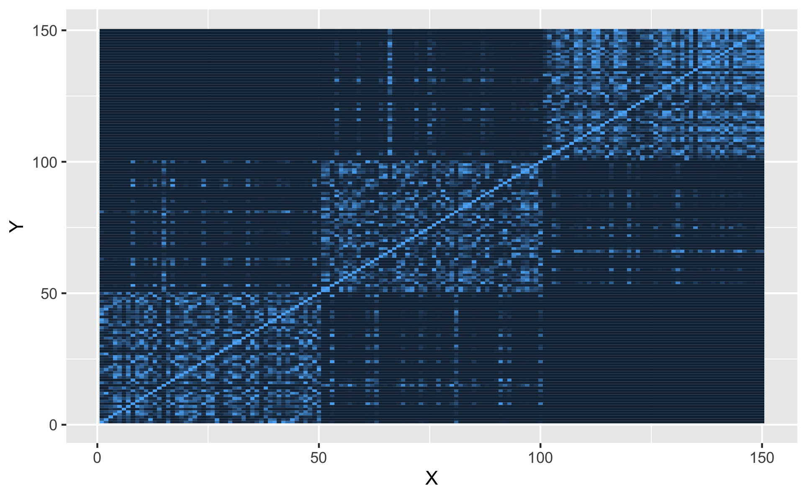
```

Avec cette représentation les groupes d'individus sont plus facilement visibles qu'avec le noyau précédent. Donc, le regroupement d'individu devrait être plus simple en utilisant cette représentation.  
Le choix de $\sigma$ s'est porté sur 1 puisqu'il s'agissait de la valeur qui nous permettait d'avoir la représentation idéale, en termes de groupes.

Comme précédemment, nous avons trouvé les meilleurs hyperparamètres au sens de la mesure utilisée sur le jeu de donnée d'entraînement, puis nous avons appliqué notre méthode avec ces hyperparamètres sur le jeu de données test.


Sur le graphique ci-dessous, on constate qu'avec le meilleur ensemble d'hyperparamètres, conformément à chaque mesure et à chaque algorithme, la répartition des scores est globalement identique. Toutefois, les scores du self-expressiveness du SCMK K-means sont plus  stable que ceux du SCMK. Les scores du SCMK sont toujours fluctuants, mais la représentation des données a permis à l'algorithme d'avoir des scores en moyenne plus élevés qu'avec le noyau précédent.

```{r res_ari_rbf, fig.show = "hold", out.width = "50%", fig.align = "default",fig.cap="Boxplot des scores obtenus sur le jeu de données test après 30 applications des algorithmes. Le boxplot de gauche concerne la mesure ARI, et celui de droite la mesure NMI."} 
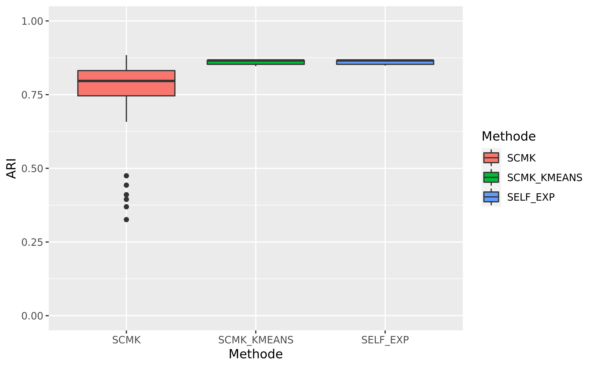
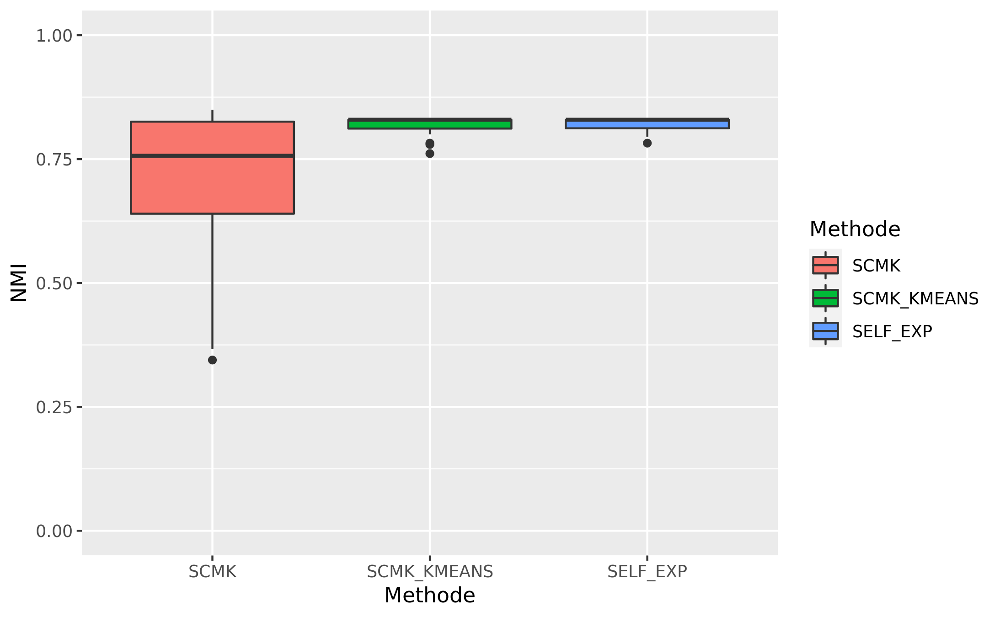
```

```{r pred_ari_rbf, fig.show = "hold", out.width = "40%", fig.align = "center",fig.cap="Graphiques des prédictions obtenues à partir de l'optimisation des hyperparamètres par rapport à la mesure ARI. Le premier graphique est celui du SCMK, le second celui du SCMK K-Means et le dernier correspond au Self-Expressiveness."} 
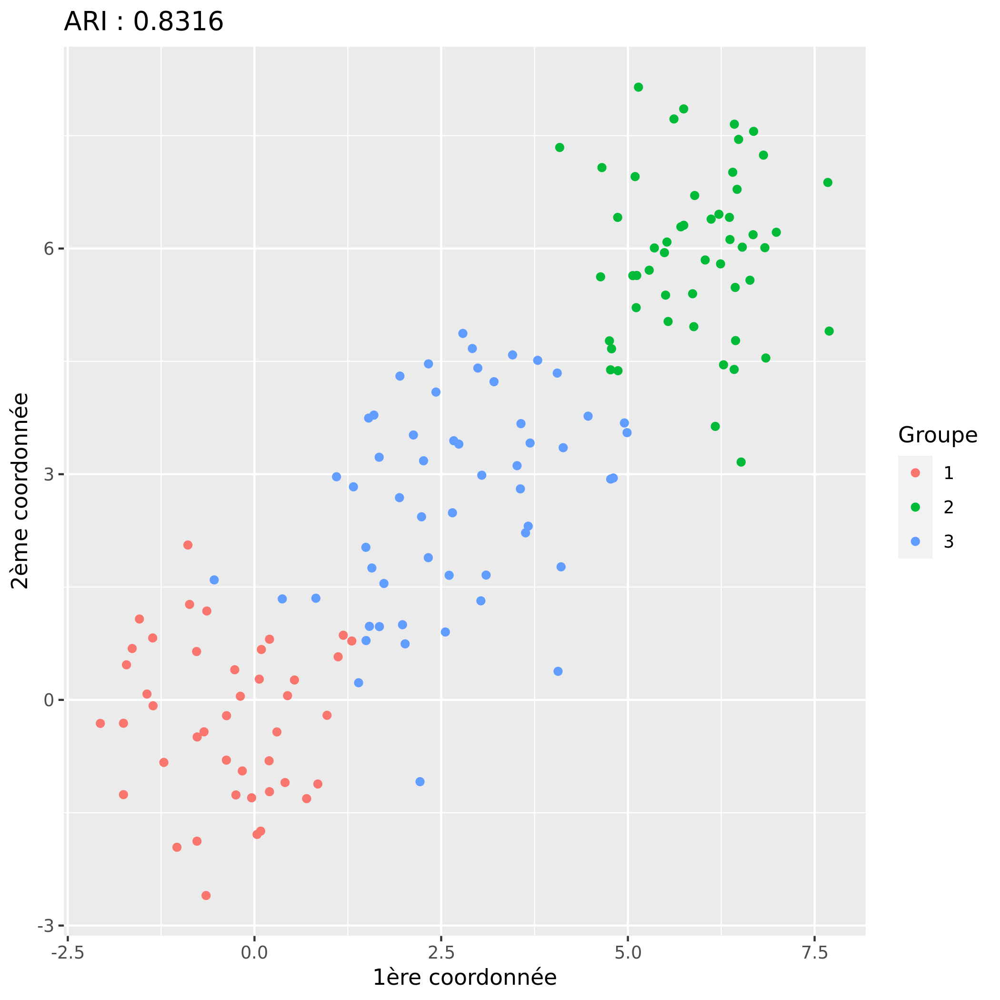
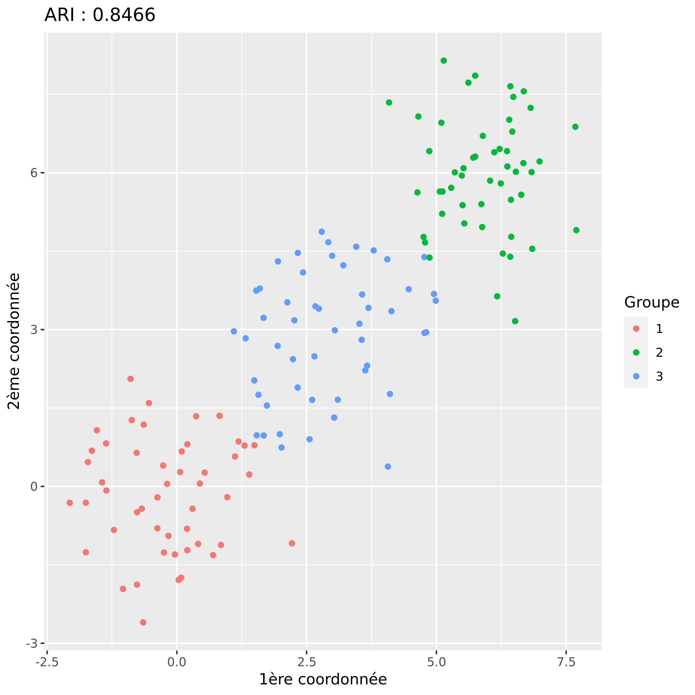
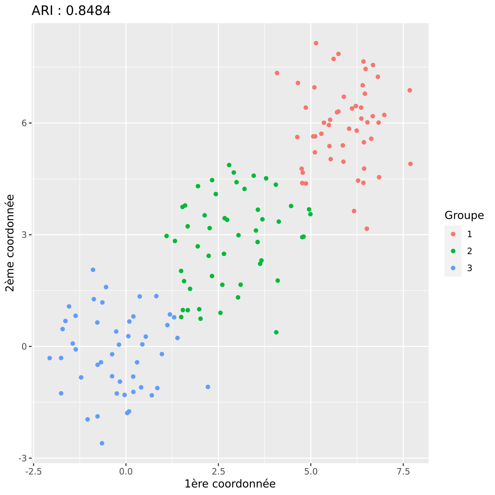
```
Les regroupements ci-dessous sont quasiment identiques entre les méthodes à quelques individus près. Ceci montre l'efficacité du SCMK et de ses variants lorsque le cadre est idéal, ce qui est le minimum souhaité. Toutefois, ces prédictions, et particulièrement celle du SCMK, représentent le cadre où l'algorithme converge vers une "bonne" solution. Pour un même jeu de données, les résultats peuvet être drastiquement différents, ce qui est vraiment problématique lors d'une utilisation concrète, réelle.

Par ailleurs, sur cet exemple, les clusters qui ont été formés par le SCMK sont moins intuitifs que ceux formés par ses variants. Cette possibilité risque aussi de poser problème lors de l'interprétation des regroupements, lorsque l'algorithme sera utilisé dans un cadre concret. Le souci n'étant pas le fait qu'il fasse apparaître des liens qui peuvent être plausibles et non-intuitif, mais plutôt l'apparition de certains ne faisant pas réellement sens.


### 5.1.3. Mélange de noyaux

Le mélange de noyaux a pour objectif de permettre de choisir l'utilisation "optimale" des différentes représentations des données obtenues grâce aux différents noyaux. La combinaison de ces représentations a pour volonté d'extraire le maximum d'informations permettant de regrouper au mieux nos données.

Les différents noyaux utilisés sont donc :

-

-

-

-

-

```{r MelangerKernels, fig.show = "hold", out.width = "50%", fig.align = "default",fig.cap="TEST DE LA VISUALISATION"} 
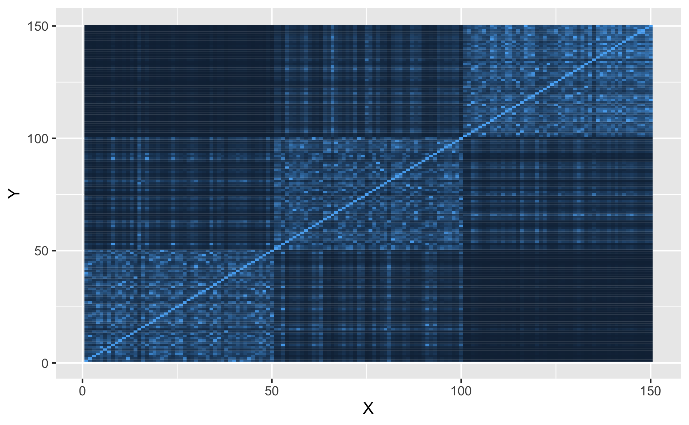


```

## 5.2. Autre exemple plus compliqué (1 noyau puis mélange)


# 6. Discussion

- Temps de calcul
- Optimisation hyper-paramètres
- Souci de stabilité

# Conclusion

# Mesures utilisées

# Bibliographie

